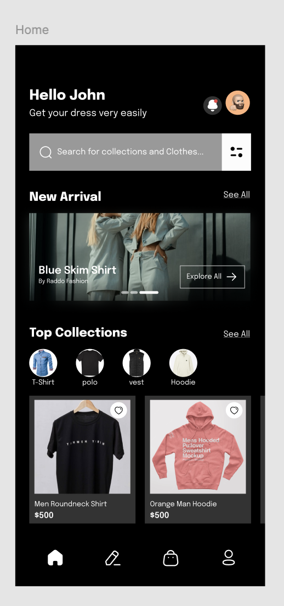

# MerchHub api - E-Commerce Application apoi

## Project Overview

**MerchHub api** is a basic e-commerce application designed to provide a streamlined shopping experience for both customers and store owners (vendors). The application allows customers to browse products, manage a shopping cart, and place orders. 

## Goal
The goal of this Project is to create a api that will replicate the homepage

## Key Features

### User Features
- **User Registration & Authentication**: Users can create an account, log in 
- **Vendor Application**: User Can apply to become a vendor, normally applications are suppose to go through sort of approval, but it is approved automatically (because it is a simple app)
- **Product Catalog**: Customers can browse products by category, view product details, and add them to their shopping cart.

### Vendor Features
- **Vendor Registration**: Vendors can sign up, log in.
- **Product Management**: Vendors can list new products, update existing product details, and remove products from their store.

---

## Technology Stack

- **Backend**: Adonisjs (for handling API requests)
- **Database**: Mysql
- **Authentication**: JWT (JSON Web Tokens) for secure user sessions
<!-- - **Hosting**: AWS, Heroku, or similar cloud hosting platform -->

